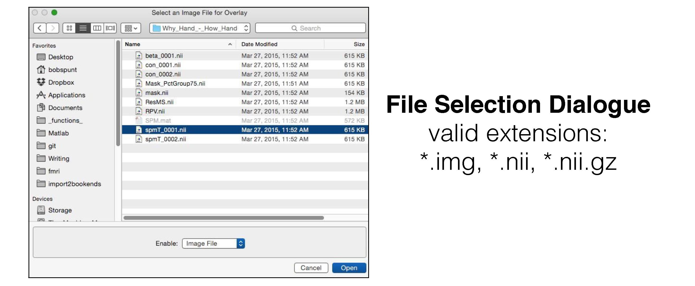
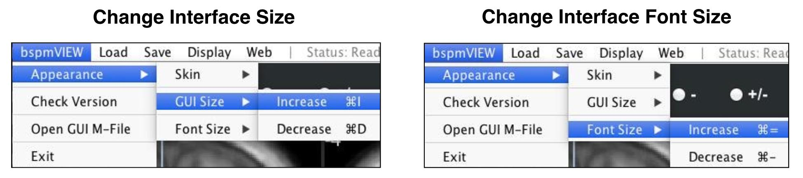
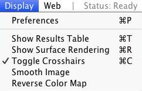
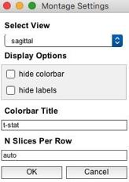

# bspmview


## Contents
1. [About](#about)
2. [Installation](#installation)
3. [Launching *bspmview*](#launching-bspmview)
4. [The Main Interface](#the-main-interface)
5. [Changing the Interface Appearance](#changing-the-interface-appearance)
6. [Customizing Preferences](#customizing-preferences)
7. [Slice Montage](#slice-montage)
8. [Have Questions?](#have-questions)

## About ##
_bspmview_ is a graphical user interface for overlaying, thresholding, and visualizing 3D statistical neuroimages in MATLAB. It requires a number of core functions from the MATLAB software [Statistical Parametric Mapping](http://www.fil.ion.ucl.ac.uk/spm/). It has been tested on SPM8+. _bspmview_ was directly inspired by and in some cases incorporates code from from two other statistical image viewers: [xjview](http://www.alivelearn.net/xjview8/developers/) and [FIVE](http://mrtools.mgh.harvard.edu/index.php/Main_Page). The idea behind bspmview was to integrate and improve some of the great features of these two viewing programs in an interface that I find to be more intuitive, accessible, and customizable. Most importantly, all of its features require **no additional third-party software** (other than SPM, of course). Note that some features in _bspmview_ will be automatically disabled if you load in a statistical image that was generated outside of SPM (for instance, in FSL), or if _bspmview_ is unable to locate the model output files (e.g., SPM.mat, ResMS.nii) associated with the provided statistical image.

|                                                                     **Features**                                                                     |
|------------------------------------------------------------------------------------------------------------------------------------------------------|
| reads .img/.hdr, .nii, and .nii.gz                                                                                                                   |
| can read non-statistical/non-intensity images (e.g., binary mask, ROIs, or count images)                                                             |
| quickly switch display of contrast sign (+, -, or +/-)                                                                                               |
| voxelvise and cluster-base uncorrected and corrected image thresholding                                                                              |
| automatic anatomical labeling with the Anatomy Toolbox or Harvard Oxford atlases                                                                     |
| generate interactive table of labeled activation peaks, and save possibly publication-worthy tables to CSV                                           |
| customizable and possibly publication-worthy surface renderings                                                                                      |
| customizable and possibly publication-worthy slice montages                                                                                          |
| save thresholded whole-brain maps or specific clusters as either intensity images or binary masks                                                    |
| save region-of-interest images by growing spheres/boxes around a coordinate (and optionally intersect the sphere/box with thresholded overlay image) |
| customizable color maps (different maps, set max/min, reverse)                                                                                       |
| automatically open [Neurosynth](http://neurosynth.org/locations/) in browser to examine connectivity/coactivation maps for current coordinate        |
| and many other random features...                                                                                                                    |

## Installation ##

1. Download the software
2. Put the *bspmview* folder either on your MATLAB path or in the "toolboxes" subfolder of your SPM installation. Note that only the parent folder needs to be on the path. The subfolder "supportfiles" is added to the MATLAB path whenever you run bspmview.

## Launching *bspmview*
If you put bspmview in the "toolboxes" subfolder of your SPM installation, you will be able to launch *bspmview* by selecting it from the "Toolbox:" dropdown menu in the SPM graphical user interface. Otherwise, as long as bspmview is on your MATLAB path you can start it from the command line by entering:
```
>> bspmview
```
This will open a file selection dialogue window with which you can select the overlay image you'd like to display:



You can also give bspmview filenames for overlay and underlay images as arguments. The following will display the overlay *spmT_0001.img* on the default underlay (this example assumes that the image is in your working directory; otherwise, you'd need to enter the full path):
```
>> bspmview('spmT_0001.img')
```
This will overlay *spmT_0001.img* on to *T1.nii*:
```
>> bspmview('spmT_0001.img', 'T1.nii')
```

## The Main Interface
Once *bspmview* has launched you should see something that approximates this:


Explore the interface. Click on stuff. Change values and see what happens. Try right clicking on one of the slice views and you should something like this:


Try selecting **Save ROI at Current Location** and a menu window should pop up:


Whoa! Spheres AND Boxes? Customizable sizes? And what's this? I have the option to intersect my Sphere or Box with the currently displayed (i.e., thresholded) overlay!


## Changing the Interface Appearance
If the interface looks wonky (e.g., font sizes are too small) or if you just want to mess with the way it looks, you can do so from from the leftmost menubar entitled *bspmview*. For instance, you increase or decrease the size of the GUI window, or you can scale the font size of all text in the interface either up or down:



Note the shortcut keys (called "accelerators" in MATLAB), which are displayed for Mac OS X here but should appear with "Ctrl" in place of the "Command" key (e.g., Ctrl=+ should increase font size).


## Customizing Preferences
Given that most of the *bspmview* functionality should be self-explanatory (and given that I have to get back to my real job!), I'll end the documentation for now by explaining the fields of the Display Preferences menu, which you can find under **Display** in the **Menu Bar**:



This should bring up a menu that looks like this:


These preferences allow you to customize a number of display features included in *bspmview*. Modified preferences are saved and reloaded the next time you use *bspmview*.  Under **Thresholding** you can modify:
* **Corrected Alpha**: This controls the corrected alpha to use when doing family-wise error correction

Under **Thresholding** you can also modify two parameters that control how many peaks (local maxima) are identified in the currently thresholded overlay. This will primarily affect the results tables, which display all local maxima. But it will also affect where the crosshair goes when you select **Go to Nearest Peak** from one of the slice view menus. The parameters are:
* **Peak Separation**: This is the minimim distance (in mm) separating the peaks. The larger the distance, the fewer the peaks. You may know this by the *Dis variable in the SPM software.
* **# Peaks/Cluster**: This is the maximum number of peaks to identify per cluster. The smaller the number, the fewer the peaks. You may know this by the *Num* variable in the SPM software.

Under **Anatomical Labeling** you can modify:
* **Name**: This is the Atlas to grab the labels from (currently the Anatomy Toolbox and Harvard-Oxford are the only two preloaded into *bspmview*)

Under **Surface Rendering** you can modify parameters that control how your surface renderings will look. Most of the parameters correspond to those present in [SurfPlot](http://mrtools.mgh.harvard.edu/index.php/SurfPlot) by Aaron P. Schultz, which is the function upon which this feature is based:
* **Surfaces to Render**: This controls which of the four views to show (L=Left, R=Right). For instance, the default L/R Medial/Lateral will show:


* **Surface Type**: This controls the type of surface to render on. The above was created using the *Inflated* surface option.
* **Shading Type**: Set the shading information for the surface
* **N Vertices**: This determines the resolution/quality of the rendering.
* **Shading Min**: Set the min greyscale value for the surface underlay (range of 0 to 1)
* **Shading Max**: Set the max greyscale value for the surface underlay (range of 0 to 1)
* **Add Color Bar**: Option to include/exclude colorbar from rendering.
* **Round Values?**: Rounds all values on the surface to nearest whole number. Useful for binary mask images.
* **Nearest Neighbor?**: Only the value from the closest voxel will be used. Useful for mask and label images.
* **Dilate Inclusive Mask?**: This will use *spm_dilate* to slightly dilate the suprathresholded image so that small or non-surface (e.g., sulcul) activations are visible.

# Slice Montage

To visualize your thresholded map overlaid on a montage of anatomical slices, use the **Slice Monage** function, which you can find under **Display** in the **Menu Bar**:


You should now see a pop-up menu that will allow you to select the slice **view** (sagittal, axial, coronal); hide either the color and/or the coordinate labels appearing on each slice; give the color (if not hidden) a snazzy title; and specify the maximum number of slices to include in each row of the montage:



Pressing **OK** will advance you to the next challenge you will have to face: Choosing the slices to display. By default, _bspmview_ automatically provides a representative list of slices containing local maxima in the thresholded image. Feel free to change, or just go with it knowing that you can easily delete individual slices from the resulting montage:


If it worked, you should see something approximating the mind-blowing work-of-art presented below:


If there are too many slices, you can delete individual slices by right-clicking on any individual slice (when you do this, _bspmview_ will try to automatically re-arrange the montage so it continues to look super hot). If chose to have labels, you can mess with the size and position of those using the - you guessed it - *_Labels_ menu.

## Have Questions?
Feel free to shoot me (Bob) an email at: bobspunt@gmail.com